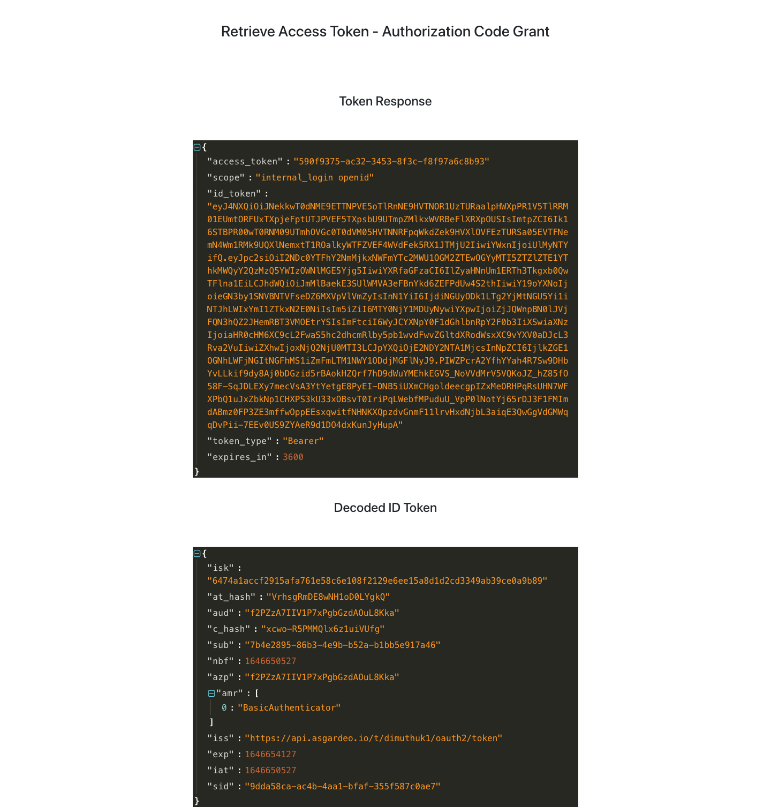

## Authorization Code Flow - Sample React Application



This application is to demonstrate the Authorization code flow and How to retrieve an access token via Authorization Code grant flow. 

### Setup a New OIDC Application in Asgardeo Console with New Customer User Account

1. Go to [Asgardeo console](https://console.asgardeo.io) and create a new OIDC Application(Traditonal Web Application/Standard Application).
2. Go to `Protocol` tab in your application configuration page.Select `code` as a Allowed grant type to allow Authorization Code grant in your application.
3. Add `http://localhost:3000` as a redirect URL. Save the Configurations.
4. You can get the `clientID` and `clientSecret` values from the same Protocol tab of your application. 
5. As we need to do the user authentication in Authorization Code grant flow, we need to create a customer user account in Asgardeo. You can find more about that from [here](https://wso2.com/asgardeo/docs/guides/users/manage-customers/#onboard-a-customer).


### Setup Sample Application

1. Clone this application repository.
2. Update the configurations in `src/config.js` file with proper values.
```
{
    "ORG_NAME": "<org_name>",
    "RESPONSE_TYPE": "code",
    "SCOPE": "<scopes seperated by space>",
    "REDIRECT_URI": "http://localhost:3000",
    "CLIENT_ID": "<client_id_of_the_application>",
    "CLIENT_SECRET": "<client_secret_of_the_application>",
    "GRANT_TYPE": "authorization_code"
}
```
3. Go to the project folder and run `npm install && npm start`
